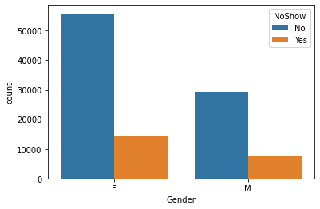
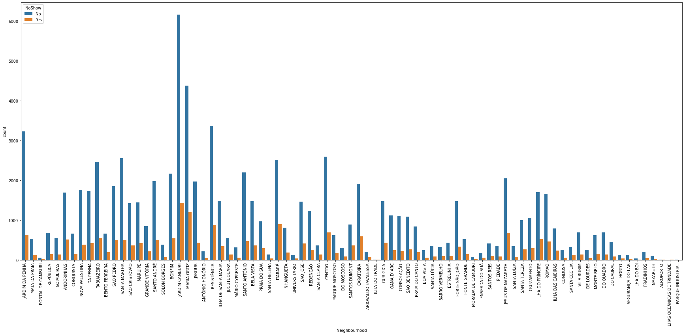
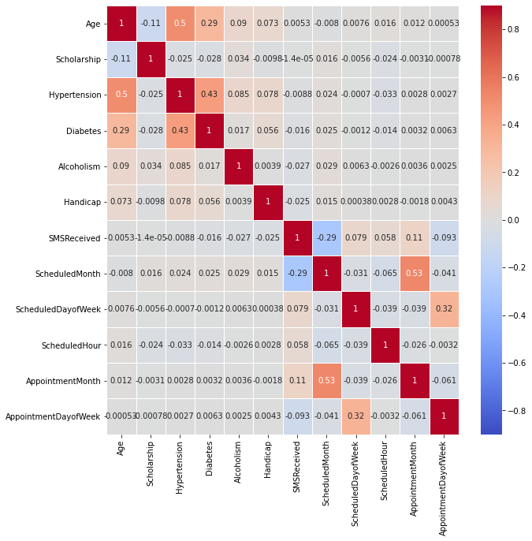
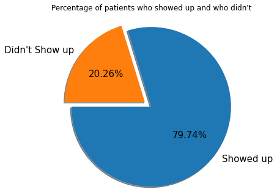
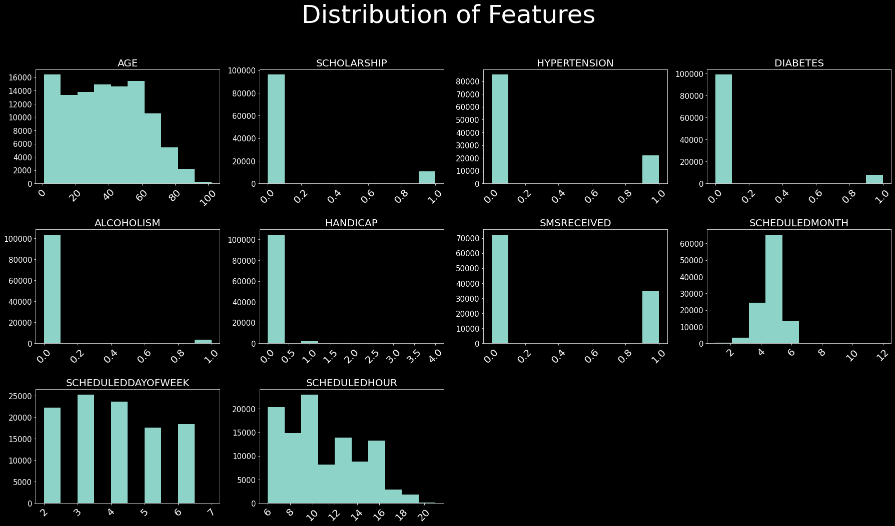
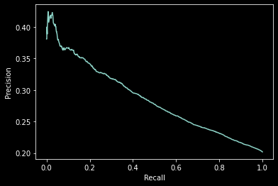
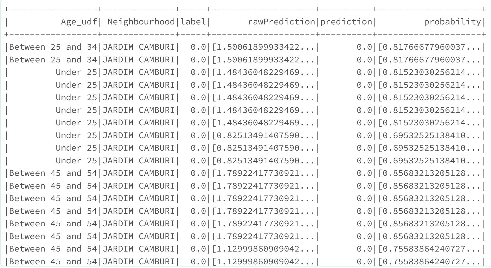
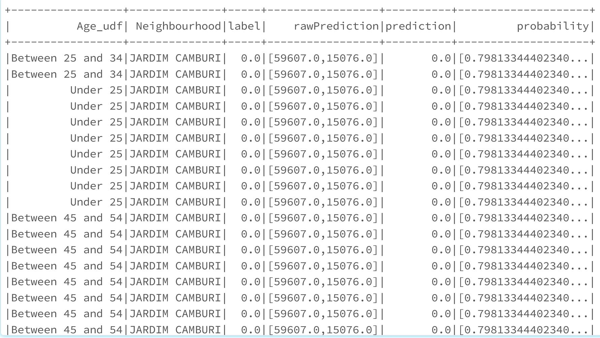
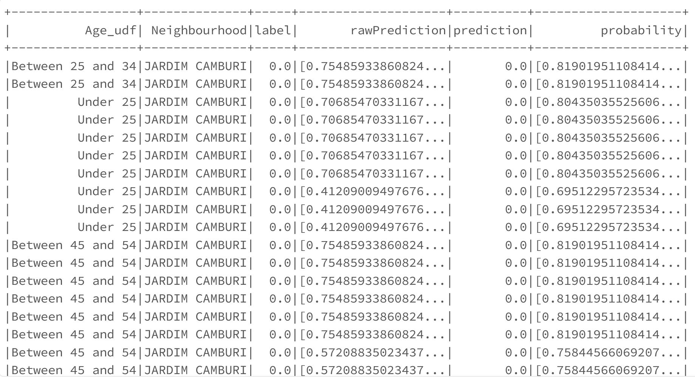

# Medical No Shows Analysis

## Business Problem

Patient no-shows are a long-standing problem that depletes resources and jeopardizes the quality of healthcare services. They also result in the loss of projected income, especially in services where resources are scarce and expensive.

This could be due to various factors ranging from Age related issues to environmental factors. It could also be due to other ailments patients might have which impede their scheduled visits. For this analysis, we will look at the patient data and try to predict the showup rate of the patients to their appointment at the clinic.

From the data, we are assuming that Age and the neighbourhood of the clinic could be major factors. So, let's look at the data, perform some exploratory data analysis, pre-process and build machine learning models to predict the likelihood of the patients no-shows.

**Questions to Ask**

- Do certain gender has more commitment to medical schedules than the other one?
- Where is the most appointments take place?
- What is the percentage of patients who show up on their appointements vs. who don't?
- Do older patients more commited to medical schedules than others?

## Dataset
Dataset sourced from Kaggle: [Patient No-Show Data]("https://www.kaggle.com/joniarroba/noshowappointments")

**Data Dictionary**

- PatientID: Unique identifier for every patient.
- AppointmentID: Unique identifier for every appointment a patient makes.
- ScheduledDay: Day of the appointment at the clinic.
- AppointmentDay: Day of appointment made.
- Age: Age of the patient.
- Neighbourhood: Locality of the clinic.
- Scholarship: If the patient has scholarship.
- Hipertension: If the patient has hypertension.
- Diabetes: If the patient is diabetic.
- Alcoholism: If the patient is alcoholic.
- Handcap: If the patient is handicapped.
- SMS_received: If the patient has SMS remainder on.
- No-show: If the patient showed up at the clinic for his/her appointment.

Dataset can be uniqely queried based on a combination key of 'PatientID' and 'AppointmentID'. 

## Analysis

### Data Wrangling

**Code Snippet of Data Cleaning**

```
#Import the required libraries

from pyspark.sql.types import IntegerType, DateType
from pyspark.sql.functions import *


#PatientId should be int, not float

df = df.withColumn('PatientId',df['PatientId'].cast(IntegerType()))

df = df.withColumn('ScheduledMonth',month(col('ScheduledDay'))).withColumn('ScheduledDayofWeek',dayofweek(col('ScheduledDay'))).withColumn('ScheduledHour',hour(col('ScheduledDay')))

df = df.withColumn('AppointmentMonth',month(col('AppointmentDay'))).withColumn('AppointmentDayofWeek',dayofweek(col('AppointmentDay')))


#Convert ScheduledDay and AppointmentDay to datetime

df = df.withColumn('ScheduledDay',df['ScheduledDay'].cast(DateType()))

df = df.withColumn('AppointmentDay',df['AppointmentDay'].cast(DateType()))


#Check the dataset

df.show()
```

### Exploratory Data Analysis

Listing out our conclusions from the Exploratory Data Analysis:

<p align="center">
  
</p>



- Percentage of patients who show up on their appointments represents 79.7%.
- Percentage of patients who Don't show up on their appointments represents 20.2%.
- Both genders have same commitment to medical schedules.
- Patients Who didn't show up have an average of 15 days between registeration day and their appointments.
- Patients Who show up have an average of 8 days between registeration day and their appointments.
- As Duration increases, the ability of patients to show up on their appointments decreases.
- "JARDIM CAMBURI" is the most frequent place.
- Younger patients are more commited to their appointments' schedules than old ones.

<p align="center">
  
</p>

<p align="center">
  
</p>

### Data Pre-Processing

#### Creating Features and Labels

**Code Snippet for Distribution of Variables**

```
from matplotlib import cm


fig = plt.figure(figsize=(25,15)) ## Plot Size 

st = fig.suptitle("Distribution of Features", fontsize=50,

                  verticalalignment='center') # Plot Main Title 


for col,num in zip(df.toPandas().describe().columns, range(1,11)):

    ax = fig.add_subplot(3,4,num)

    ax.hist(df.toPandas()[col])

    plt.style.use('dark_background') 

    plt.grid(False)

    plt.xticks(rotation=45,fontsize=20)

    plt.yticks(fontsize=15)

    plt.title(col.upper(),fontsize=20)

plt.tight_layout()

st.set_y(0.95)

fig.subplots_adjust(top=0.85,hspace = 0.4)

plt.show()
```



**Code Snipped for User Defined Functions**

```
#Method to categorize age variable

def udf_multiple(age):

      if (age <= 24):

        return 'Under 25'

      elif (age >= 25 and age <= 34):

        return 'Between 25 and 34'

      elif (age >= 35 and age <= 44):

        return 'Between 35 and 44'

      elif (age >= 45 and age <= 54):

        return 'Between 45 and 54'

      elif (age >= 55 and age <= 64):

        return 'Between 55 and 64'

      elif (age >= 65):

        return 'Over 64'

      else: return 'N/A'

 

education_udf = udf(udf_multiple)

df=df.withColumn("Age_udf", education_udf('Age'))
```

#### Preparing Data for ML

**Code Snippet for Creating Data Pipeline**

```
pipeline = Pipeline(stages = stages)

pipelineModel = pipeline.fit(df)

df = pipelineModel.transform(df)

selectedCols = ['label', 'features'] + cols

df = df.select(selectedCols)

df.printSchema()
```

### Modeling

#### Logistic Regression

<p align="center">
  
</p>

**Model Predictions**<br>

<p align="center">
  
</p>

Test Area Under ROC: 0.609

#### Decision Tree Classifier

**Model Predictions**<br>

<p align="center">
  
</p>

Test Area Under ROC: 0.5

#### Random Forest

**Model Predictions**<br>

<p align="center">
  
</p>

Test Area Under ROC: 0.59

#### Gradient-Boosted Tree Classifier

**Model Predictions**<br>

<p align="center">
  
</p>

Test Area Under ROC: 0.604

### Performance Metrics

**Classification Report Output**

```
from sklearn.metrics import classification_report,confusion_matrix


#Print classification report

print(classification_report(y_true, y_pred))

              precision    recall  f1-score   support

         0.0       0.80      1.00      0.89     25698
         1.0       0.26      0.00      0.00      6601

    accuracy                           0.80     32299
   macro avg       0.53      0.50      0.44     32299
weighted avg       0.69      0.80      0.71     32299


```

**Confusion Matrix**

```
#Print confusion matrix

print("Confusion matrix:\n",confusion_matrix(y_true, y_pred))

Confusion matrix:
 [[25681    17]
 [ 6595     6]]

```

### Analysis Results

- From our analysis Logistic Regression model performed the best with highest ROC, at 0.609, which is closely followed by the Gradient-Boosted Tree Classifier at 0.604.
- Our worst perfoming models are the Random Forest at 0.596 and Decision Tree Classifier at 0.5. So, we can say our Gradient-Boosted Tree Classifier did a better job of classifying our positive/negative class (Patients showing-up/not showing-up for appointment) in the dataset.
- Usually an ROC value of 0.7-0.8 is considered acceptable, but our values lie close to the center line which is a random chance. So, we probably need to improve our model by trying out other classification techniques.

## Conclusion

- Our model correctly classifies if there is a show-up at the clinic 80% of the time. Which is not bad but can be further improved by expanding the featureset.
- Based on our initial assumption, gender doesn't play a significant role in the commitment to the appointments at the clinic.
- Age plays a major role where the younger patients are more commited to their appointment schedules than the older ones. Makes sense as younger patients can visit a clinic by themselves where as older patients need help.

## Recommendations

- "JARDIM CAMBURI" is most frequented so it would be best to study the systems and procedures employed at that clinic and replicate those in the other clinics as well.
- It would help with reducing no-shows if the clinics try to reduce wait time between the appointment and scheduled days.
- Another recommendation is to have other ways of remainder systems like Email/Phone in place to regularly check with the older patients as SMS usage among the older groups tend to be lower due to small screens on mobile phones and difficulty to read.

## References

- https://www.kaggle.com/joniarroba/noshowappointments
- https://towardsdatascience.com/apache-spark-mllib-tutorial-part-3-complete-classification-workflow-a1eb430ad069
- https://towardsdatascience.com/machine-learning-with-pyspark-and-mllib-solving-a-binary-classification-problem-96396065d2aa

